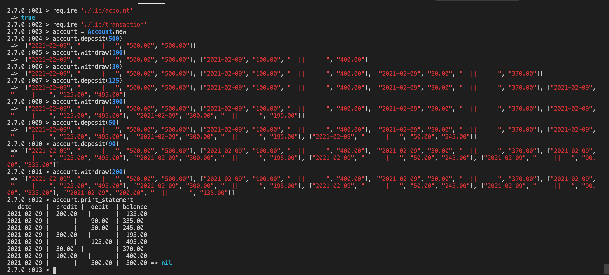

# bank_tech_test
--------------
# Instructions for running the project, dependencies and tests:

- run 'bundle install' from the command line
- The project can be functionally run in any repl such as irb.
- To run unit tests for this project, run 'rspec' from the command line
- To run the linter, run 'rubocop' from the command line.

--------------
# Requirements
--------------
- You should be able to interact with your code via a REPL like IRB or the JavaScript console. (You don't need to implement a command line interface that takes input from STDIN.)
- Deposits, withdrawal.
- Account statement (date, amount, balance) printing.
- Data can be kept in memory (it doesn't need to be stored to a database or anything).
--------------
# User Stories
As a user
So that I can add money to my account
I would like to make a deposit

As a user
So that I can remove money from my account
I would like to make a withdrawl

As a user
So that I can see my current activity
I would like to print my account statement (date, amount, balance)
--------------
Objects/Properties/Messages:
--------------
Objects (classes):
- account
- transaction

Properties (instance variables):
- balance
- history

Messages (methods):
- make a deposit
- make a withdrawl
- print my account statement
- get the date

--------------
Input/Output Table
--------------

account = Account.new
=> Account[2D3C90820F598F2]
account.deposit(100)
=> nil
account.deposit(200)
=> nil
account.withdraw(150)
-> nil
account.view_statement
=> date || credit || debit || balance
8/2/21  ||  100   ||       ||   100
8/2/21  ||  200   ||       ||   300
8/2/21  ||        ||  150  ||   150

-------------------
# Initial Plan

My plan was to break down the problem into extremely small problems. This is a technique which I need to improve in, especially when I am unsure as to how to achieve the final product. This was a good example of that. I knew roughly how to set up my account class, with it's 
withdraw and deposit methods, and equally how to test for them. I used irb to ensure that my logic was guiding me down the right path.

Once the Account class became to clunky with transaction instance variables, I extracted this to a separate class and gave my attempt at testing account in isolation.

# Below is a screenshot of my working Bank Account application. 

--------------------
Reflections

Overall, I think that it went pretty well. I really enjoyed doing this challenge; I planned thoroughly, and was able to break down the overall problem into small chunks, which helped me towards the end when things got more complex. 

I felt that I was disciplined with my TDD, catching myself out in one instance where I wrote a bit too much code before writing my next test. Some of my tests, when testing output, had some long lines in them, which I would have hoped to refractor, however the output of my program came in the same format (one long line) so, unfortunately,  I was not able to change this in my tests.

I attempted to extract as much as a could from my Account class to my Transaction class, but had a couple lines of code in some of my Account methods which potentially could be refractored further, as they were on the verge of being too long and had a few repeated lines. 

Similarly, I attempted at testing in isolation, which I hope I did successfully, however I cannot be 100% certain that it was. 

Lastly, I formatted the table to make it a little more clear when the user prints their statement, however it meant messing around with white spaces within my strings, which to me seemed slightly messy.